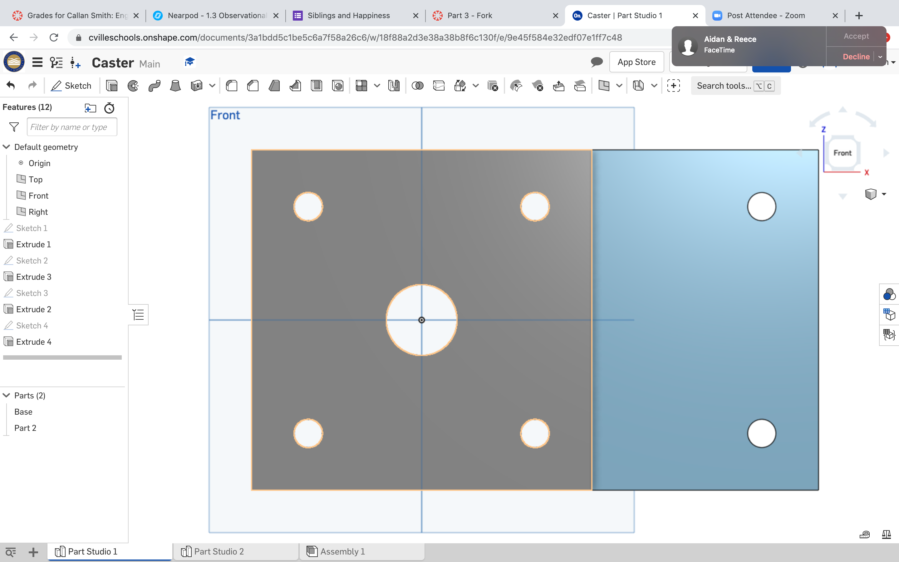
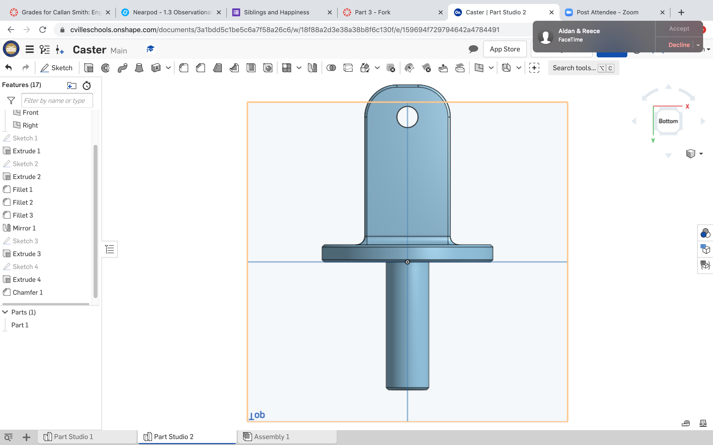
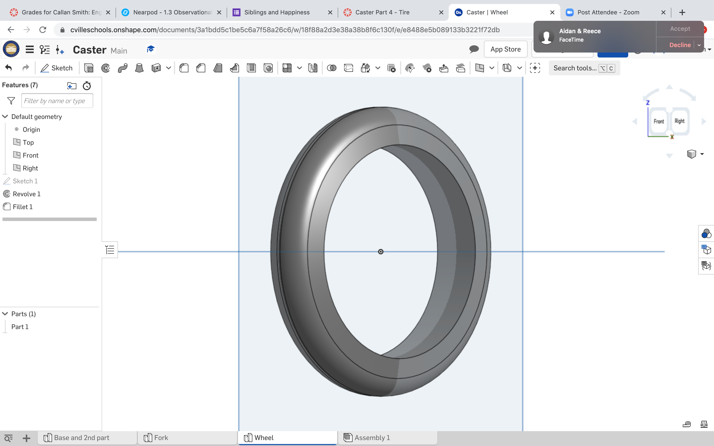
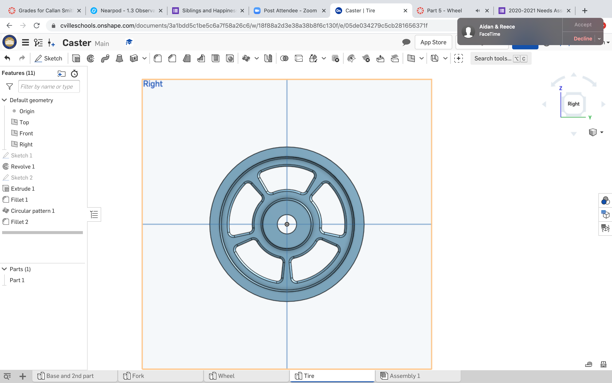
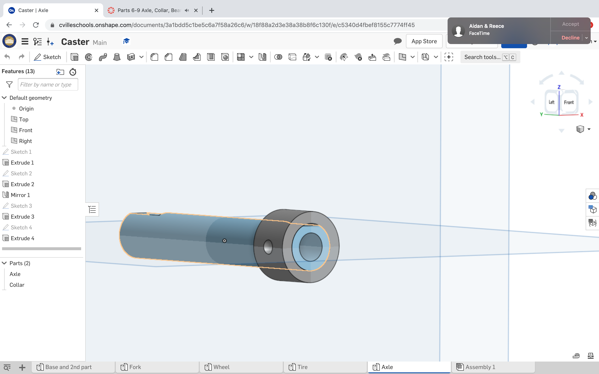
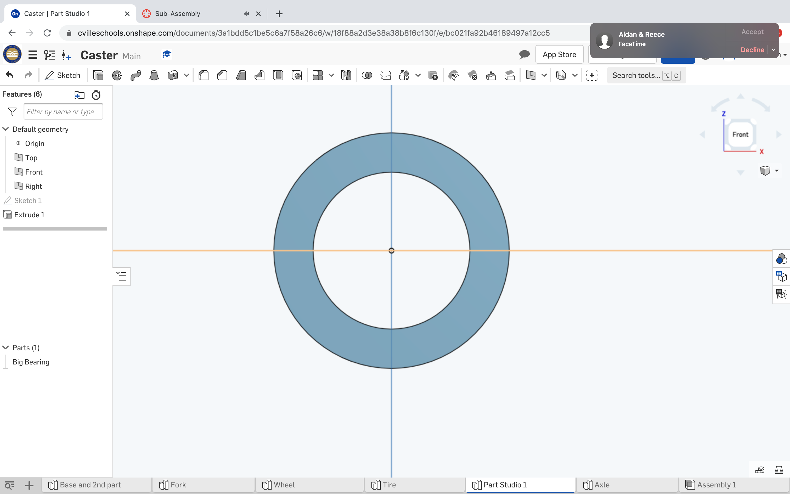
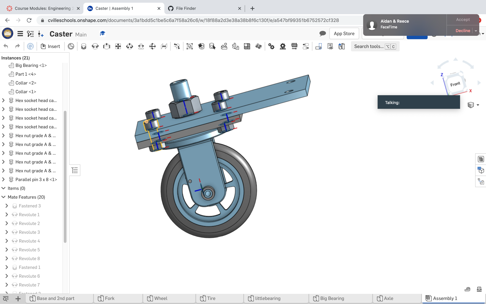

# BasicCad1
# BasicCAD

We are creating a caster.

---
## Table of Contents
* [Table of Contents](#Table-of-Contents)
* [Base](#Base)
* [Mount](#Mount)
* [Fork](#Fork)
* [Tire](#Tire)
* [Wheel](#Wheel)
* [AxleCollarBearings](#AxleCollarBearings)

## Base

### Description

The first assignment is to create the caster base.  The base's dimensions are 200 mm x 120 mm and 8 mm thick.  It has 6 holes 10 mm wide and 20 mm from the edge equally spaced along the edges.

### Evidence
[The Base in Onshape](https://cvilleschools.onshape.com/documents/0d70f655203ca304cb3c5b7d/w/f55603f962f6fc74f5548a68/e/41d730c570a8d75fce9f51b6)

### Image
This is how you will write image code for INTERNALLY STORED images on your repo.   just FYI.
~~~

~~~

### Reflection

This was my first Onshape part and [following along with Dr. Shields made it super easy.](https://www.youtube.com/watch?v=93BFUD-HAG8&feature=emb_title&scrlybrkr=5670f0b4)  I learned about 
* sketching (shortcut **shift-s**)
* constructions lines (shortcut **Q**)
* dimensions (shortcut **D**)
* extruding both add and remove (shortcut key **E**)
* linear patterns (no shortcut)

Onshape is awesome.  I found it really helpful to rename all my sketches.  It is going to be a GREAT year in engineering.

---

## Mount

### Description
The 2nd assingment was the mount. The mount is a piece very simalair to the base. It has the exact same hole dimensions. The only thing different about it is that its a sqaure instead of a rectangle. The dimensions are 120mmx120mm. It it also 8mm extruded
### Evidence
 [The mount in OnShape] (https://cvilleschools.onshape.com/documents/3a1bdd5c1be5c6a7f58a26c6/w/18f88a2d3e38a38b8f6c130f/e/9e45f584e32edf07e1ff7c480

### Image

### Reflection

This was the 2nd CAD assingment we've had, and for me it was the easiest. By following what Mr H. did in class I was was able to figure that you didnt have to create another document to do this part. All you have to do is, sketch a sqaure on top of your base and make sure that the upper left hand corner is connected to the base upper left hand corner. From there make the dimensions 120mm by 120mm and make sure it lines up wiht you base. Use the use featture to select the circles you created for the base. After that, all you have to do is press extrude, and click new. Extrude to 8mm and youll be done.
---

## Fork

### Description
The fork was the 3rd assingment we had to do for BasicCad. So far this was the hardest because we learned anout filet. The dimensions for this part were complicated, but the basic circle had a diameter of 80mm and was extruded 8 mm. You then make the two Fork parts. To do this you draw a rectangle and through an array of filets and dimensions you have one of the fork parts. After that you just mirror the feature over the plane you want to mirror it over
### Evidence
 [The fork in Onshape](https://cvilleschools.onshape.com/documents/3a1bdd5c1be5c6a7f58a26c6/w/18f88a2d3e38a38b8f6c130f/e/159694f729794642a4784491)
### Image

### Reflection
I thought this was going to be harder than it was. I got a little confused just following the directions, the video by Dr. Shields helped tremendously. https://www.youtube.com/channel/UCaL7ijtuZI4C2F8Vdg-R4fQ. The hardest part of this assingment was getting the mirror to work. If figured out you have to select the plane parallel to where you want to mirror, to get it to mirror in the correct place.

---

## Tire

### Description
The tire was the 4th basic cad assigment. To begin this assingment we mad a trapizoid using dimensions and symetric edits. The bottom line was 20 mms long,and the top was 15.47 mm long. the two sides were symetric and equal. After I made the trapazoid, all i had to do was revolve the tire around a horizantol construction line.
### Evidence
[The Tire in OnShape](https://cvilleschools.onshape.com/documents/3a1bdd5c1be5c6a7f58a26c6/w/18f88a2d3e38a38b8f6c130f/e/e8488e5b089133b3221f72db)
### Image

### Reflection

This time, I went completly off of the video by Dr. Sheilds.https://www.youtube.com/watch?v=ReEGioIYSus&feature=emb_title. This made it very easy to complete thos assingment. The hardest part was making the trapizoid, becasue at first I didnt have the two construntion lines. So I had to make sure to have the vertical and horizontal constrution lines.
---

## Wheel

### Description
The wheel is the 5th assingment for BasicCad. This to me was the hardest assingment. It is somewhat simalair to the tire. You first create and I shaped firgure. Using different dimensions and realtions from the video you get it to be the size you want. After that you revolve it around a horizantal constructipn line. Finally you make one rivet, and with a circular patter you make 5 going around the whole wheel.
### Evidence
[The wheel in onshape](https://cvilleschools.onshape.com/documents/3a1bdd5c1be5c6a7f58a26c6/w/18f88a2d3e38a38b8f6c130f/e/05de034279c5cb281656371f)
### Image

### Reflection

This was definitely the hardest assingment so far. You learn a bunch of new relations, and making the first I shape was hard. Watching this video buy Dr. Shields helped a lot. https://www.youtube.com/watch?v=RKeALFyqSGw&feature=emb_title
---

## AxleCollarBearings
### Description
The AxleCollarBearing were three differnt mini assingments. The axle was definitely the hardest. The assingment is to make a cylinder with two little divits on each side for a screw. The Collar was very straight forward for the most part. The bearing was just two circles extruded.

### Evidence
[Axle and Collar](https://cvilleschools.onshape.com/documents/3a1bdd5c1be5c6a7f58a26c6/w/18f88a2d3e38a38b8f6c130f/e/c5340d4fbef8155c7774ff45)
[Bearing](https://cvilleschools.onshape.com/documents/3a1bdd5c1be5c6a7f58a26c6/w/18f88a2d3e38a38b8f6c130f/e/bc021fa92b46189497a12cc5)
### Image

### Reflection
The axle was the hardest assingment. I struggled with the divet you make. I figured out that the line I was using the make the divit was only 4 mm from the origin, when it should of been 5. I ran into a problem with the collar when I was making the hole in it. I though that the was supposed to be on the collar itself. I realized that it should of been on the front plane instead. This video helped me make all three parts. https://www.youtube.com/watch?v=2r7YqGuF1vY&feature=emb_title
---

## Assembly

### Description
Assembly was the final assingmeant of BasicCad. I wasnt building anything new, I was just putting every thing together. You connect the the fork, axle, wheel, and bearings using a revolute mate. You then have to connect you big bearings to your axle using a parallel mate. Finally you have to insert different screws and bolts to fasten everything together.
### Evidence
[Assembly](https://cvilleschools.onshape.com/documents/3a1bdd5c1be5c6a7f58a26c6/w/18f88a2d3e38a38b8f6c130f/e/a547bf99351b6752572cf328)
### Image

### Refelction
This part of the assingement was the hardest for me. The revolute, and fasten mates were pretty straight forward. I struggled with the parallel mate. I figured out that you had to turn either your bearing, or your axle, before you mate it. This helped me finish it. Inserting the screws was easy as long as you make sure that you insert the right size.

## Dorthys Dowels

### Description

### Evidence

### Image

### Reflection
